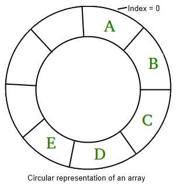

# Assignment 2: Circular Array

## Task

In this sub-project, you will implement one class:

- Circular Array: `CircularArrayList`.

An array is called **circular** if its first element comes before its last element. In general, a circular array allows insertions and deletions in O(n) time. The elements in this circular array are stored in a static array of size *N*.

### Runtime:

The run time of each member function is specified in parentheses at the end of the description.

## Class Specifications

### UML Class Diagram

<table cellpadding="3" border="1">
	<tbody><tr><th>CircularArrayList</th></tr>
	<tr>
		<td>
			<tt>-</tt> entry_count:Integer 
			<tt>-</tt> array_capacity:Integer 
			<tt>-</tt> elements:Type[]
		</td>
	</tr>
	<tr>
		<td>
			<u><tt>+</tt> CircularArrayList(in size:Integer)</u> 
			<u><tt>+</tt> ~CircularArrayList()</u> 
			<tt>+</tt> size():Integer 
            <tt>+</tt> max_size():Integer 
			<tt>+</tt> empty():Boolean 
			<tt>+</tt> front():Type 
			<tt>+</tt> back():Type 
            <tt>+</tt> at(in idx:Integer):Type 
            <tt>+</tt> set(in idx:Integer, in obj:Type ) 
			<tt>+</tt> insert(in idx:Integer, in obj:Type ) 
			<tt>+</tt> erase( in idx:Integer ) 
		</td>
	</tr>
</tbody></table>

A skeleton for this class is provided in the [source directory](https://github.com/wildart/CSCI373/tree/main/assign/hw2) in the file [CircularArrayList.h](https://github.com/wildart/CSCI373/tree/main/assign/hw2/CircularArrayList.h).

### Description

This class stores a finite list of `n` (zero or more) elements stored in a static array. The following are properties of this class:

- If there are zero elements in the list, the list is said to be empty.
- The maximum number of elements in the list is `N`.

### Member Variables

The class has at three suggested member variables:

- A pointer to an instance of `Type`, `Type *elements`, to be used as a storage array,
- An element counter `int entry_count`, and
- The capacity of the list, `int array_capacity`.

You may chose to use these or use whatever other member variables you want.

### Member Functions

#### Constructors

`CircularArrayList( int n = 10 )`

The constructor takes as an argument the capacity of the array and allocates memory for the storage array. If the argument is either 0 or a negative integer, set the initial capacity of the array to 1. The default initial capacity is 10. Other member variables are assigned as appropriate.

#### Destructor

`~CircularArrayList()`

The destructor deletes the memory allocated for the storage array.

#### Accessors

This class has four accessors:

`Type& at( int i ) const`
- Return the object at the position `i` of the list, with bounds checking. If `i` is not within the range of the container, an exception of type `std::out_of_range` is thrown. (Θ(1))

`int size() const`
- Returns the number of objects currently stored in the list. (Θ(1))

`bool empty() const`
- Returns `true` if the list is empty, `false` otherwise. (Θ(1))

`int max_size() const`
- Returns the capacity of the list (the capacity of the storage array). (Θ(1))

#### Mutators

This class has three mutators:

`void set( int i, const Type& obj )`
- Set the element `obj` in the position `i` in the list. If position is not within the range of the container, an exception of type `std::out_of_range` is thrown. (Θ(1))

`void insert( int i, const Type& obj )`
- Insert the element `obj` in the position `i` in the list.  We need to make room for the new element in the `i`th position
    - If the number of elements in the list is less then the the capacity of the list, we shift forward the `(n - i)` element `A[i], ..., A[n-1]` where `n` is the current number of objects in the list.
    -  If the number of elements in the list is equal to the the capacity of the list, we shift forward **circular way** the `(n - 1)` element `A[i], ..., A[n-1], A[0], ..., A[i-2]` where `n` is the current number of objects in the list.
- If position is not within the range of the container, an exception of type `std::out_of_range` is thrown. (O(n))

`void erase(int i)`
- Removes the element at in the position `i`  from the list. The hole left by the removed element is filled by shifting backward the `(n - i - 1)` elements `A[i+1], ..., A[n-1]` where `n` is the current number of objects in the list. If position is not within the range of the container, an exception of type `std::out_of_range` is thrown. (O(n))

## Test Driver Program

### Compilation

#### Local Development

For local development you are required to have a C++ compiler installed on your local machine.

- In order to compile test driver program `ArrayListDriver`, you will need to place following files in the local folder on your computer:
    - `CircularArrayList.h`
    - `ArrayListDriver.cpp`
    - `ArrayListTester.h`
    - `Tester.h`
    - `csci373.h`
    - Optional files:
        - `testfile.txt` contains test commands
        - `Makefile` is the build configuration file

- All files located in [`assign/hw2` folder](https://github.com/wildart/CSCI373/tree/main/assign/hw2) of the course repository [https://github.com/wildart/CSCI373](https://github.com/wildart/CSCI373). You can download whole repository as a zip archive.

- Copy all files is the local folder, and run the following command in the command line inside the folder to compile the test driver program:
    - `g++ -std=c++11 -o ArrayListDriver ArrayListDriver.cpp`

- Or if the `make` program is installed:
    - `make`

- Run `ArrayListDriver` executable file from the command line, see the test driver commands below.

- To execute a set of recorder tests, run in the command line following command `./ArrayListDriver < testfile.txt`.
    - Fix your program so all the test report `Okay`.

#### Repl.it

You can use [repl.it](https://repl.it) service as the development environment while working on this lab.

- Go to [repl.it](https://repl.it) website, press the `Start coding` button.
- Select `Import from Github` tab and paste the course repository URL
    - `https://github.com/wildart/CSCI373`
- Inside the `assign/hw2` folder, open `CircularArrayList.h` and start coding.
- Press **Run** button to compile and run the test driver program with provided collection of test.
    - Fix your program so all the test report `Okay`.
### Commands

| Command               | Tests
|-----------------------|-----------------------------------------------------------
| new                   | create an object with the default constructor
| new n                 | create an object with the constructor with an argument `n`
| delete                | destroy an object
| empty b               | `empty() == b`
| size n                | `size() == n`
| at i n                | `at( i ) == n`
| at-exception i        | `at( i )` throws an exception
| print                 | print the elements in order separated by dashes
| insert i n            | `insert( i, n )` succeeds
| insert-exception i n  | `insert( i, n )` throws an exception
| erase i               | `erase( n )` succeeds
| erase-exception i     | `erase( n )` throws an exception
| exit                  | terminate program
| !!                    | run the last command
| summary               | short summary of memory usage
| details               | detailed list of memory (de)allocations
| memory n              | test if `n` bytes is allocated

## Submission

### Coding Style

In any programming project, matching the existing coding style is important. Having different coding styles intermixed leads to confusion and bugs. Students are required to follow the particular existing coding style that maintains the indentation style in `.cpp` and `.h` files using spaces, not tabs.

In particular, pay close attention to function declarations and how the function name begins the line after the function return type. For helper functions which are limited in scope to a specific file, you must declare the function as `static` in the same file in which it is used.

*Indentation*: The indentation style for your work have to be 4 spaces. Many students are taught to use tabs for indentation, which can make code very hard to read, especially when there are several levels of indentation.

For additional information of C++ coding style see [Google C++ Style Guide](https://google.github.io/styleguide/cppguide.html).

### Before You Submit

You are required to test that your submission works properly before submission. Make sure that your program compiles without errors. Once you have verified that the submission is correct, you can submit your work.

### Your Submission

Program submissions should be done through the Blackboard.

For Assignment #2, submit the following files:

- `CircularArrayList.h`
